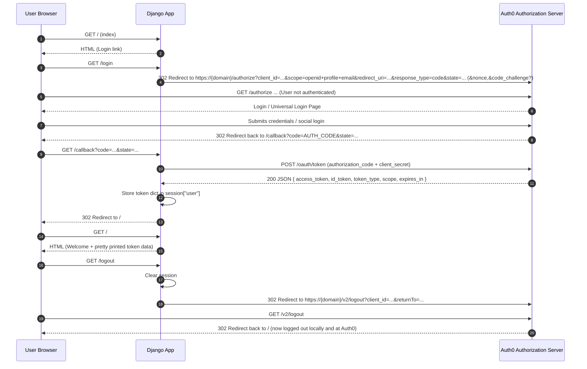

# Auth0 Authentication Flow (Django Sample `01-Login`)

This document explains **exactly** what happens when a user logs into (and out of) this sample Django web application using Auth0. It covers:

- Endpoints involved (`/login`, Auth0 `/authorize`, `/callback`, `/logout`)
- The redirect-based OAuth 2.0 / OpenID Connect Authorization Code Flow
- Data sent to Auth0 (query params + POST body)
- Data returned by Auth0 (authorization code, tokens, claims)
- Session storage structure
- Formats (URL query string, JSON, JWT)
- Where each step happens in this codebase

---
## 1. Key Pieces in This Project

| Component          | File / Setting                              | Purpose                                                                                 |
| ------------------ | ------------------------------------------- | --------------------------------------------------------------------------------------- |
| Auth0 config       | `.env` → loaded in `settings.py`            | Supplies `AUTH0_DOMAIN`, `AUTH0_CLIENT_ID`, `AUTH0_CLIENT_SECRET`, `AUTH0_CALLBACK_URL` |
| OAuth client setup | `webappexample/views.py` (`oauth.register`) | Configures Authlib with Auth0 OIDC metadata + scopes                                    |
| Login endpoint     | `views.login`                               | Starts the Authorization Code flow (redirect to Auth0)                                  |
| Callback endpoint  | `views.callback`                            | Exchanges authorization code for tokens; saves them in the session                      |
| Index page         | `views.index` + `templates/index.html`      | Shows login / logout links + pretty-printed session token JSON                          |
| Logout endpoint    | `views.logout`                              | Deletes local session and redirects to Auth0 logout                                     |

---
## 2. High-Level Sequence

```mermaid
description Auth0 Login Flow
datagrid
```


---
## 3. Detailed Step-by-Step

### 3.1 Index (`GET /`)
- View: `index` in `views.py`.
- Renders `index.html`.
- Provides `session` context var: `request.session.get("user")` (the entire token dict if logged in, else `None`).
- The template shows either a Login link (`/login`) or a welcome + Logout link.

### 3.2 User Clicks Login (`GET /login`)
- View: `login` in `views.py`.
- Determines callback URL: `AUTH0_CALLBACK_URL` env var OR builds it from the current request (`/callback`).
- Calls `oauth.auth0.authorize_redirect(request, callback_url)` (Authlib helper) which:
  1. Builds an **/authorize** URL using Auth0 OIDC discovery metadata: `https://{AUTH0_DOMAIN}/authorize`.
  2. Generates and stores a `state` value in the Django session for CSRF protection.
  3. May generate a `nonce` (for ID token replay protection) and/or PKCE parameters depending on configuration (this sample does not explicitly configure PKCE; Authlib may or may not auto-add depending on version—assume classic confidential client using client secret here).
  4. Issues a 302 redirect to the browser.

### 3.3 Redirect to Auth0 `/authorize`
Auth0 receives a GET with (standard OIDC Authorization Code request):

| Param                                                                  | Source                          | Meaning                                                                |
| ---------------------------------------------------------------------- | ------------------------------- | ---------------------------------------------------------------------- |
| `response_type=code`                                                   | Authlib                         | We want an authorization code                                          |
| `client_id`                                                            | `.env`                          | Identifies this app                                                    |
| `redirect_uri`                                                         | Provided by app                 | Must match an allowed callback URL configured in the Auth0 application |
| `scope=openid profile email`                                           | `client_kwargs` in registration | Requesting an ID token + profile + email claims                        |
| `state`                                                                | Generated                       | Anti-CSRF; must echo back unchanged                                    |
| `nonce` (maybe)                                                        | Generated (optional)            | To bind ID token to this auth request                                  |
| `code_challenge` / `code_challenge_method` (not in this simple sample) | PKCE (optional)                 | Only if PKCE is used                                                   |

If the user is not authenticated at Auth0, they see the Universal Login page. After credential or social provider login, Auth0 creates a session there.

### 3.4 Auth0 Redirects Back to `/callback`
- URL: `GET /callback?code=AUTHZ_CODE&state=SAVED_STATE`.
- Django view: `callback` in `views.py`.
- First line: `token = oauth.auth0.authorize_access_token(request)` which performs:
  1. Validates `state` matches saved session value.
  2. If OK, sends a **POST** to Auth0 Token Endpoint (from discovery doc `/.well-known/openid-configuration`) usually `https://{domain}/oauth/token`.

### 3.5 Token Endpoint Request (Server-to-Server)
`POST https://{AUTH0_DOMAIN}/oauth/token`

Typical JSON/x-www-form-urlencoded body fields:

| Field           | Value                                                               |
| --------------- | ------------------------------------------------------------------- |
| `grant_type`    | `authorization_code`                                                |
| `client_id`     | Your client ID                                                      |
| `client_secret` | Your client secret (because this is a confidential server-side app) |
| `code`          | Authorization code from query string                                |
| `redirect_uri`  | Must exactly match the one used in /authorize                       |
| `code_verifier` | (Only if PKCE used)                                                 |

### 3.6 Token Endpoint Response
Content-Type: `application/json` (example shape):
```json
{
  "access_token": "eyJ..." | "XYZopaque...",
  "id_token": "eyJhbGciOiJSUzI1NiIsInR5cCI6IkpXVCJ9...",
  "scope": "openid profile email",
  "expires_in": 86400,
  "token_type": "Bearer"
}
```
Notes:
- `access_token` may be a JWT or an opaque string. If you did NOT request an API audience, Auth0 usually issues a short token usable only at the `/userinfo` endpoint (might be opaque). If you configure an API `audience`, you get a JWT access token with API claims.
- `id_token` is **always a JWT** with base64url-encoded header.payload.signature.
- No `refresh_token` because scope does not include `offline_access` and default settings disallow refresh tokens for regular web flows unless enabled.

### 3.7 What Gets Stored in the Django Session
The entire `token` dict is stored at `request.session["user"]`:
```python
{
  'access_token': '...',
  'id_token': '...',
  'scope': 'openid profile email',
  'expires_in': 86400,
  'token_type': 'Bearer',
  # Authlib may add parsed fields such as 'userinfo' if userinfo endpoint fetched (not in this code)
}
```
Because the session backend is the default Django signed cookie (unless overridden), this dict is serialized and signed (not encrypted) and sent to the browser as a cookie. (If you have not configured a different session engine, consider session size & secrecy). For production you may want server-side sessions (cache / DB) or store only minimal identifiers.

### 3.8 ID Token Structure (JWT)
The `id_token` (header.payload.signature) decodes to JSON like:
```json
Header: { "alg": "RS256", "typ": "JWT", "kid": "..." }
Payload: {
  "iss": "https://{AUTH0_DOMAIN}/",
  "sub": "auth0|1234567890",
  "aud": "{AUTH0_CLIENT_ID}",
  "iat": 173...,
  "exp": 173...,
  "nonce": "..." (if used),
  "name": "User Full Name",
  "nickname": "user",
  "picture": "https://.../avatar.png",
  "email": "user@example.com",
  "email_verified": true
}
```
Validation steps (Authlib handles internally):
- Signature verification using JSON Web Key Set from `https://{domain}/.well-known/jwks.json`.
- `aud` must match client id.
- `iss` must match domain URL.
- `exp` and `iat` checks.
- `nonce` check if used.

### 3.9 After Storing Session
- View redirects to `/` (`index`).
- Template now has a `session` object and prints `name` via `session.userinfo.name` in example. (Note: In your template you use `{{session.userinfo.name}}`, but the stored object is just `token`. If `userinfo` is not present you might not see a name; Authlib sometimes augments the token dict with a `userinfo` field if a separate UserInfo request was performed. If missing, you would instead parse the `id_token`.)

### 3.10 Logout Flow (`GET /logout`)
- Clears Django session: `request.session.clear()` (removes local tokens).
- Redirects to Auth0 logout endpoint:
  `https://{AUTH0_DOMAIN}/v2/logout?returnTo={APP_URL}&client_id={AUTH0_CLIENT_ID}`
- Auth0 ends its session (removes its cookie) and redirects user back.
- User visiting `/` again sees the unauthenticated view.

---
## 4. Data Formats Summary

| Stage                      | Format                         | Example / Notes                             |
| -------------------------- | ------------------------------ | ------------------------------------------- |
| Browser → `/login`         | HTTP GET                       | Plain redirect link                         |
| App → Auth0 `/authorize`   | URL query string               | Encoded params (`client_id`, `scope`, etc.) |
| Auth0 → App `/callback`    | URL query string               | `code`, `state`                             |
| App → Auth0 `/oauth/token` | HTTP POST (form)               | `grant_type=authorization_code&code=...`    |
| Token response             | JSON                           | Contains tokens                             |
| ID token                   | JWT (header.payload.signature) | Base64url components                        |
| Session storage            | Python dict serialized         | Stored in Django session cookie (signed)    |
| Logout redirect            | URL query string               | `returnTo`, `client_id`                     |

---
## 5. Security Controls in Play

| Control            | Purpose                              | Implemented Where                                                                      |
| ------------------ | ------------------------------------ | -------------------------------------------------------------------------------------- |
| `state`            | CSRF protection on redirect          | Generated by Authlib in `authorize_redirect` and validated in `authorize_access_token` |
| `nonce` (optional) | Mitigate replay of ID token          | Potentially auto-managed by Authlib (not explicitly shown)                             |
| HTTPS              | Transport security                   | Required in production; local dev often HTTP                                           |
| Client Secret      | Authenticate token exchange          | Sent only server-to-server in `/oauth/token`                                           |
| Signed JWT (RS256) | Integrity & authenticity of ID token | Verified using JWKS from Auth0                                                         |

---
## 6. Potential Enhancements / Production Hardening

| Area             | Suggestion                                                    | Why                                            |
| ---------------- | ------------------------------------------------------------- | ---------------------------------------------- |
| Session Size     | Store only `id_token` or parsed claims, not entire token dict | Reduce cookie bloat (default session backend)  |
| User Model       | Map Auth0 user to Django `User` instance                      | Integration with auth decorators & permissions |
| PKCE             | Enable explicit PKCE even for confidential apps               | Defense-in-depth                               |
| Audience / APIs  | Add `audience` param on login if calling protected APIs       | Get usable (JWT) access token for backend APIs |
| Token Validation | Explicitly decode & validate ID token before trusting claims  | Defense-in-depth / auditing                    |
| Refresh Tokens   | If needed, request `offline_access` + rotate refresh tokens   | Long-lived sessions w/out re-login             |
| Error Handling   | Handle errors on callback (missing code, state mismatch)      | Better UX, security logging                    |

---
## 7. Where to Look in the Code

| Concern                   | Code Snippet                                                                                                      |
| ------------------------- | ----------------------------------------------------------------------------------------------------------------- |
| OAuth client registration | `oauth.register("auth0", client_kwargs={"scope": "openid profile email"}, server_metadata_url=...)` in `views.py` |
| Initiating login          | `login(request)` returns `oauth.auth0.authorize_redirect(...)`                                                    |
| Handling callback         | `callback(request)` calls `oauth.auth0.authorize_access_token(request)`                                           |
| Session storage           | `request.session["user"] = token`                                                                                 |
| Logout                    | `logout(request)` clears session and redirects to `/v2/logout`                                                    |

---
## 8. Troubleshooting Checklist

| Symptom                                      | Likely Cause                            | Fix                                                              |
| -------------------------------------------- | --------------------------------------- | ---------------------------------------------------------------- |
| Redirect loop at login                       | Callback URL mismatch                   | Ensure Auth0 Application Allowed Callback URLs includes your URL |
| `invalid_grant` on token exchange            | `redirect_uri` mismatch or expired code | Match exact redirect URI; avoid reusing code                     |
| No `userinfo` in template                    | Not stored                              | Either decode ID token or explicitly call userinfo endpoint      |
| `RuntimeError` at startup about missing vars | `.env` not configured                   | Copy `.env.example` and fill in values                           |
| Access token opaque                          | No `audience` requested                 | Add `audience` param when building authorize URL                 |

---
## 9. Minimal Pseudo-Code Summary

```python
# LOGIN
return oauth.auth0.authorize_redirect(request, callback_url)

# CALLBACK
# 1. Validate state
# 2. Exchange code for tokens at /oauth/token
# 3. Verify ID token (Authlib)
# 4. Save token dict in session

# LOGOUT
session.clear()
redirect(f"https://{domain}/v2/logout?returnTo=...&client_id=...")
```

---
## 10. Glossary
- **Authorization Code**: Short-lived value returned to the client (browser) that your server exchanges for tokens.
- **ID Token**: JWT containing user identity claims (for your app to authenticate the user).
- **Access Token**: Credential to call APIs (or `/userinfo` if no audience given).
- **Scope**: String list describing requested permissions/claims (`openid profile email`).
- **State**: Random string to prevent CSRF in authorization response.
- **Nonce**: Random string to bind ID token to the auth request (prevents replay).

---
## 11. Quick Visual of Data Flow

```
Browser ── GET /login ──▶ Django
        ◀─ 302 to /authorize ──
Browser ── GET https://AUTH0/authorize ──▶ Auth0
User authenticates
Browser ◀─ 302 to /callback?code=...
Browser ── GET /callback ──▶ Django
Django ── POST /oauth/token ──▶ Auth0 (server-side)
Django ◀─ JSON {id_token, access_token,...}
Django stores session and 302 to /
Browser ── GET / ──▶ Django (now authenticated)
```

---
## 12. Fast Reference Table: What & When

| When             | What is Sent                                               | To                   | How             | Result                    |
| ---------------- | ---------------------------------------------------------- | -------------------- | --------------- | ------------------------- |
| Login start      | Authorization request params                               | Auth0 `/authorize`   | Redirect (302)  | Auth0 login page          |
| After user login | `code`, `state`                                            | Django `/callback`   | Redirect (302)  | App exchanges code        |
| Code exchange    | `grant_type, code, client_id, client_secret, redirect_uri` | Auth0 `/oauth/token` | Server POST     | Tokens returned           |
| Store session    | Token dict                                                 | Django session       | Cookie (signed) | User considered logged in |
| Logout           | `client_id, returnTo`                                      | Auth0 `/v2/logout`   | Redirect (302)  | Auth0 clears its session  |

---
## 13. Frequently Asked Clarifications

Q: Why do we need both an ID token and an access token?  
A: ID token proves user identity to your app; access token authorizes calls to APIs / userinfo.

Q: Why store `client_secret`?  
A: Needed by confidential server-side app to exchange the authorization code securely.

Q: Can this be CSRF'd?  
A: The `state` parameter prevents an attacker from injecting an authorization code for another session.

Q: How do I call `/userinfo`?  
A: Use the access token in `Authorization: Bearer <access_token>`; response returns user profile claims. (Not performed in this sample.)

---
## 14. Next Steps (If Expanding This Sample)
- Add `audience` to support API access.
- Introduce Django authentication middleware integration by creating a Django `User` object.
- Implement explicit token validation + error handling.
- Adopt PKCE for additional robustness.
- Switch to server-side session storage for larger token sets.

---

Feel free to open this file beside the code and follow each function as you trace the flow.
